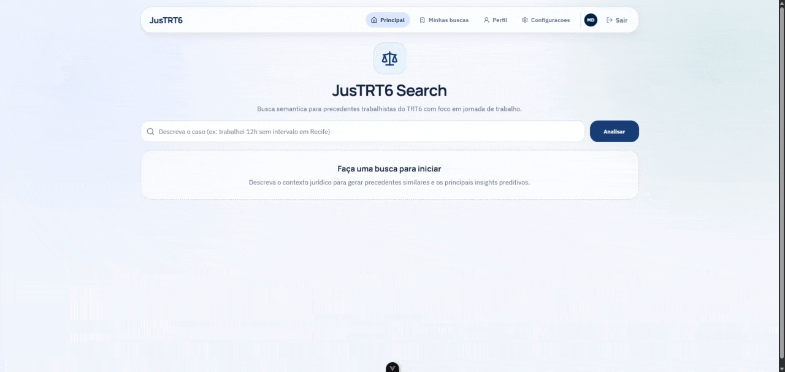
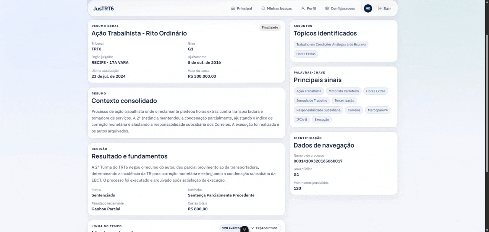
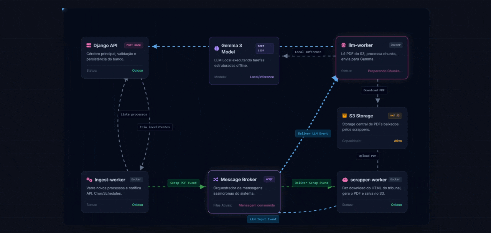
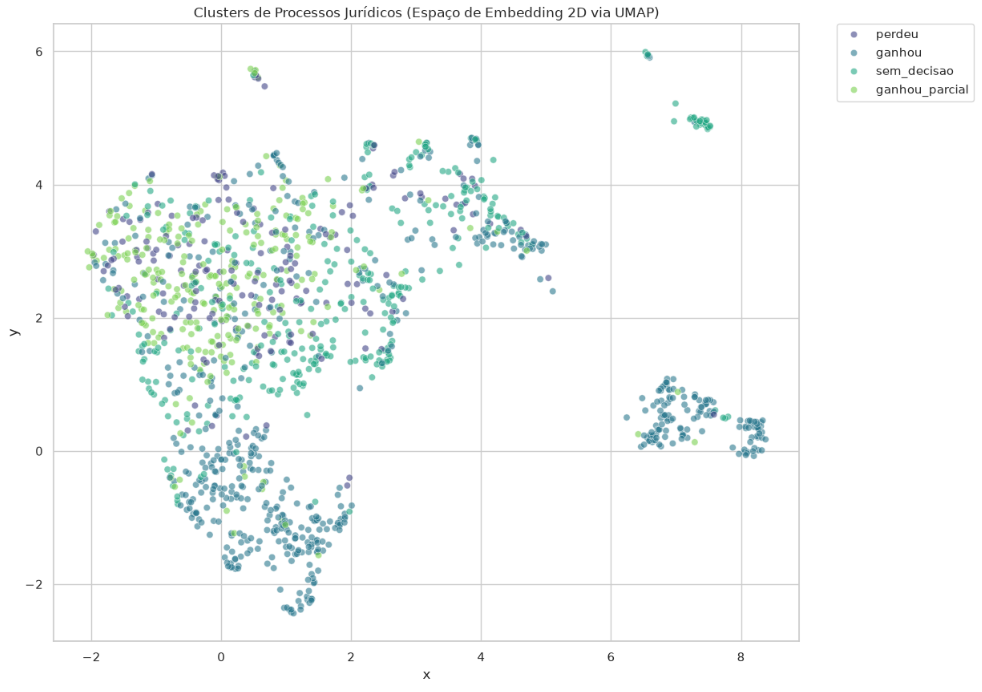
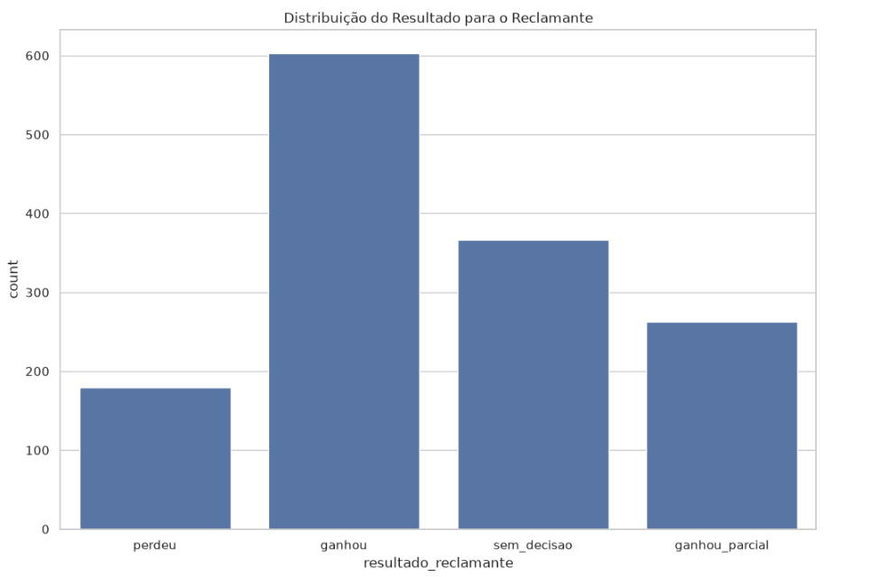
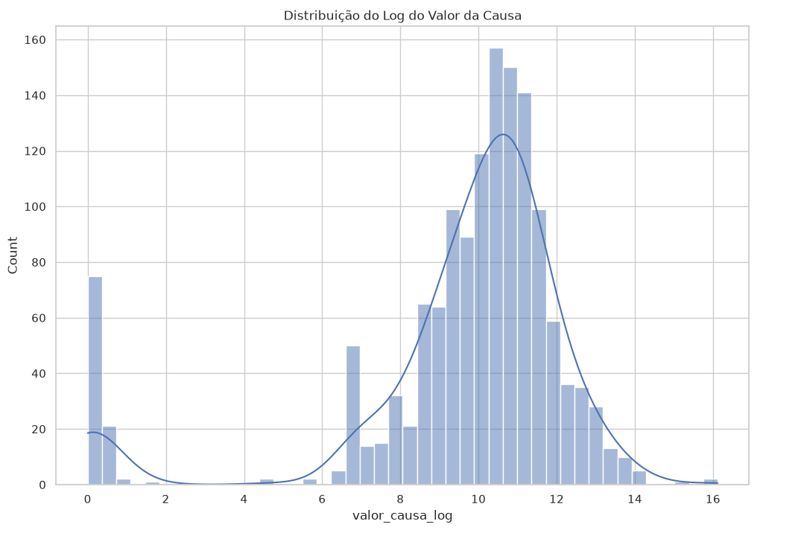
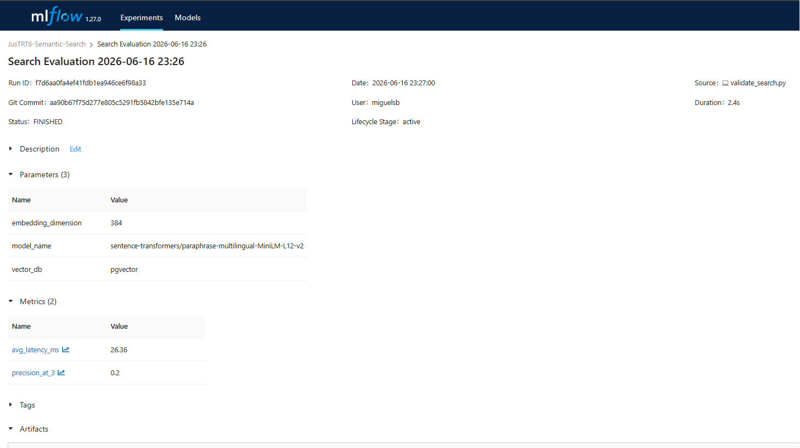

# JusTRT6 — Labor Court Intelligence & Semantic Search

[](https://www.python.org/)
[](https://www.typescriptlang.org/)
[](https://www.djangoproject.com/)
[](https://www.django-rest-framework.org/)
[](https://vuejs.org/)
[](https://www.postgresql.org/)
[](https://github.com/pgvector/pgvector)
[](https://docs.celeryq.dev/)
[](https://www.rabbitmq.com/)
[](https://www.docker.com/)
[](https://docs.pytest.org/)
[](LICENSE)

An end-to-end legal data platform that automatically ingests lawsuit records from **TRT-6** (Tribunal Regional do Trabalho da 6ª Região), bypasses PJe captchas using local OCR to download full docket PDFs, extracts structured legal data with local **LLMs** (**LangChain**), and provides sub-second **semantic vector search** via **PostgreSQL** (`pgvector`) with a modern **Vue.js (Vue 3)** dashboard.

---

## ⚡ Highlights & Impact

- **End-to-End Automated Data Pipeline**: Eliminates manual case collection across DataJud and PJe portals using resilient distributed workers managed by **Celery** and **RabbitMQ**.
- **Autonomous PJe Scraping**: Integrated **Playwright** browser automation coupled with local OCR (`ddddocr`) solves procedural captchas and downloads full PDF dockets without recurring captcha API costs.
- **Structured Legal Extraction (NLP & LLMs)**: Local LLM worker (OpenAI-compatible / LM Studio / Gemma) orchestrated with **LangChain** extracts core judicial acts, outcomes (`ganhou`, `perdeu`, `acordo`), case amounts, court costs, and legal summaries directly conforming to strict Pydantic schemas.
- **Sub-Second Vector Search**: **PostgreSQL** with `pgvector` and `sentence-transformers` (`paraphrase-multilingual-MiniLM-L12-v2`) performs cosine similarity search across indexed labor precedents in ~26ms.
- **Modern Interactive UI**: High-density **Vue.js (Vue 3)** and **TypeScript** dashboard built with Vite, Pinia, and Vue Query, featuring natural language semantic search, predictive outcome indicators, and jurimetric case analytics.
- **Complete Test Coverage & MLOps**: Comprehensive unit and integration test suites powered by **Pytest**, with experiment tracking, latency, and retrieval accuracy benchmarked in **MLflow** and visualized via **scikit-learn** and UMAP.

---

## 🖥️ Interactive Preview

| Semantic Search & Discovery | Case Details & Extracted Insights |
| :---: | :---: |
|  |  |

---

## 🏗️ System Architecture



The platform is designed as an asynchronous microservices pipeline containerized with **Docker**:
1. **Data Ingestion (ETL)**: Batches are fetched from CNJ DataJud API, normalized, and deduplicated in **PostgreSQL**.
2. **Autonomous Docket Scraping**: Processes missing documents trigger **Celery** tasks to solve PJe captchas via **Playwright** + `ddddocr`, uploading docket PDFs to S3-compatible MinIO object storage.
3. **LLM Extraction & NLP**: `worker-llm` extracts full-text markdown from PDFs, prompting a local LLM via **LangChain** for structured JSON analysis conforming to Pydantic schemas.
4. **Vector Embedding & Indexing**: Judicial summaries are embedded using `sentence-transformers/paraphrase-multilingual-MiniLM-L12-v2` (384 dimensions) and indexed directly into **PostgreSQL** via `pgvector`.
5. **Interactive UI**: The **Vue.js** + **TypeScript** dashboard performs sub-second cosine distance searches against backend **REST APIs** and displays predictive legal insights.

---

## 📦 Workspace Structure

The project is managed as a unified [uv](https://github.com/astral-sh/uv) workspace:

```
.
├── apps/
│   ├── api/              # Django 5 + Django REST Framework (REST APIs) + PostgreSQL (pgvector)
│   ├── ingestion/        # DataJud batch data pipeline client and normalizer
│   ├── worker-scrapper/  # Playwright + ddddocr scraper for PJe TRT-6
│   └── worker-llm/       # LLM docket parser using OpenDataDataLoader & LangChain
├── frontend/             # Vue.js (Vue 3), TypeScript, Vite, Tailwind/CSS, Pinia, Vue Query
├── shared/               # Shared models, S3/MinIO client, Celery client, and embeddings
├── notebooks/            # Exploratory data analysis, scikit-learn & 2D UMAP embedding cluster plots
├── scripts/              # Validation benchmark scripts (MLflow experiment tracking)
├── docs/assets/          # Product screenshots, animated flows, and research charts
├── compose.yaml          # Multi-container Docker orchestration (PostgreSQL, RabbitMQ, MinIO, workers)
└── pyproject.toml        # Root uv workspace configuration
```

---

## 🚀 Getting Started

### Prerequisites

- **Python 3.13+**
- **[uv](https://github.com/astral-sh/uv)** package manager
- **[Docker](https://www.docker.com/)** and **Docker Compose**
- **Node.js 20+** or **[Bun](https://bun.sh/)** (for frontend)

### 1. Clone & Environment Configuration

```bash
git clone https://github.com/MigueldsBatista/trt6-juris-intelligence.git
cd trt6-juris-intelligence

# Copy sample environment variables
cp .env.example .env
```

### 2. Launch Infrastructure Services

Start PostgreSQL with pgvector, RabbitMQ, and MinIO:

```bash
docker compose up -d postgres rabbitmq minio
```

Default credentials:
- **PostgreSQL**: `localhost:5432` (db: `trt6`, user: `trt6`, password: `trt6`)
- **RabbitMQ Management**: `http://localhost:15672` (user: `user`, password: `password`)
- **MinIO Console**: `http://localhost:9001` (user: `minioadmin`, password: `minioadmin`)

### 3. Backend & Workspace Setup

Install dependencies across all workspace packages:

```bash
uv sync
```

Apply database migrations:

```bash
cd apps/api
uv run python manage.py migrate
cd ../..
```

Install Playwright browser binaries (for the scraper):

```bash
uv run playwright install chromium
```

### 4. Run the Platform

#### Running via Docker Compose (Recommended)

```bash
docker compose up --build
```

#### Running Locally for Development

In separate terminal sessions:

```bash
# 1. Start Django API
cd apps/api && uv run python manage.py runserver 0.0.0.0:8000

# 2. Start Scraping Worker
uv run celery -A pje_scraper.worker worker --loglevel=INFO

# 3. Start LLM Analysis Worker
cd apps/worker-llm && uv run celery -A worker worker --loglevel=INFO

# 4. Start Frontend
cd frontend && bun install && bun dev
```

---

## 🔌 API Endpoints Reference

Base URL: `http://localhost:8000/api/`

| Method | Endpoint | Description |
|---|---|---|
| `POST` | `/api/processos/deduplicar/` | Ingests and deduplicates processes from DataJud |
| `GET` | `/api/processos/nao_possuem_pdf/` | Lists processes pending docket download |
| `GET` | `/api/processos/nao_possuem_analise/` | Lists processes pending LLM legal analysis |
| `POST` | `/api/processos/adicionar_analise/` | Receives structured LLM output and indexes embeddings |
| `POST` | `/api/processos/busca_semantica/` | 384-dimensional cosine similarity semantic search |
| `GET` | `/health/` | Service health status |

### Semantic Search Example

```bash
curl -X POST http://localhost:8000/api/processos/busca_semantica/ \
  -H "Content-Type: application/json" \
  -d '{
    "consulta": "horas extras não pagas e intervalo intrajornada suprimido",
    "top_k": 5
  }'
```

---

## 🧪 Testing & Code Quality

Automated unit and integration testing across workspaces using **Pytest**:

```bash
# Run Django REST API tests (models, serializers, vector search services)
cd apps/api && uv run pytest

# Run PJe scraper pipeline and captcha tests
cd apps/worker-scrapper && uv run pytest

# Run LLM worker parsing and prompt formatting tests
cd apps/worker-llm && uv run pytest
```

Static analysis, linting, and formatting check with Ruff:

```bash
uv run ruff check .
```

---

## 📊 Machine Learning (ML & NLP) Evaluation & Empirical Insights

### 1. High-Dimensional Embedding Interpretability (UMAP & scikit-learn)
Using 2D UMAP projection and **scikit-learn** on 384-dimensional dense vectors generated by `sentence-transformers/paraphrase-multilingual-MiniLM-L12-v2`, labor lawsuits naturally cluster in semantic space according to judicial claim outcome (`ganhou`, `perdeu`, `acordo`, `sem_decisao`):

<p align="center">
  
</p>

### 2. Statistical Distributions & Jurimetrics
Exploratory data analysis on dataset distributions generated in Jupyter notebooks (`notebooks/analise_e_interpretacao.ipynb`):

| Outcome Distribution (`resultado_reclamante`) | Claim Value Log Distribution (`valor_causa_log`) |
| :---: | :---: |
|  |  |

### 3. Search Quality Benchmark & Experiment Tracking (MLflow)
Retrieval quality, query latency, and Top-K accuracy are benchmarked using a curated legal *Golden Set* tracked with **MLflow**:

```bash
# Execute vector retrieval benchmark across PostgreSQL + pgvector
uv run python scripts/validate_search.py

# Launch MLflow Tracking UI
uv run mlflow ui
```

<p align="center">
  
</p>

Key observed metrics:
- **Average Vector Retrieval Latency (`avg_latency_ms`)**: ~26.3 ms on **PostgreSQL** (`pgvector` cosine similarity)
- **Dense Vector Representation**: 384 dimensions (`MiniLM-L12-v2` multilingual embeddings)
- **MLOps & Pipeline**: Integrated experiment metrics logging with **MLflow** for continuous model evaluation

---

## 📚 Academic Research & Paper

This project was developed at **CESAR School** (Recife, Brazil) as an applied legal intelligence system:

> **JusTRT6 Search: Uma Solução de Busca Semântica e Análise Jurídica Baseada em Embeddings para Apoio à Tomada de Decisão**  
> *Beatriz Pereira, Matheus Velame, Miguel Batista, Rafael Andrade, Rafaela Vidal, Tiago Gurgel*  
> 📄 Full Paper: [`machine-learning/jusTRT6-artigo-final.pdf`](machine-learning/jusTRT6-artigo-final.pdf)

---

## 📄 License

This project is licensed under the [MIT License](LICENSE).
